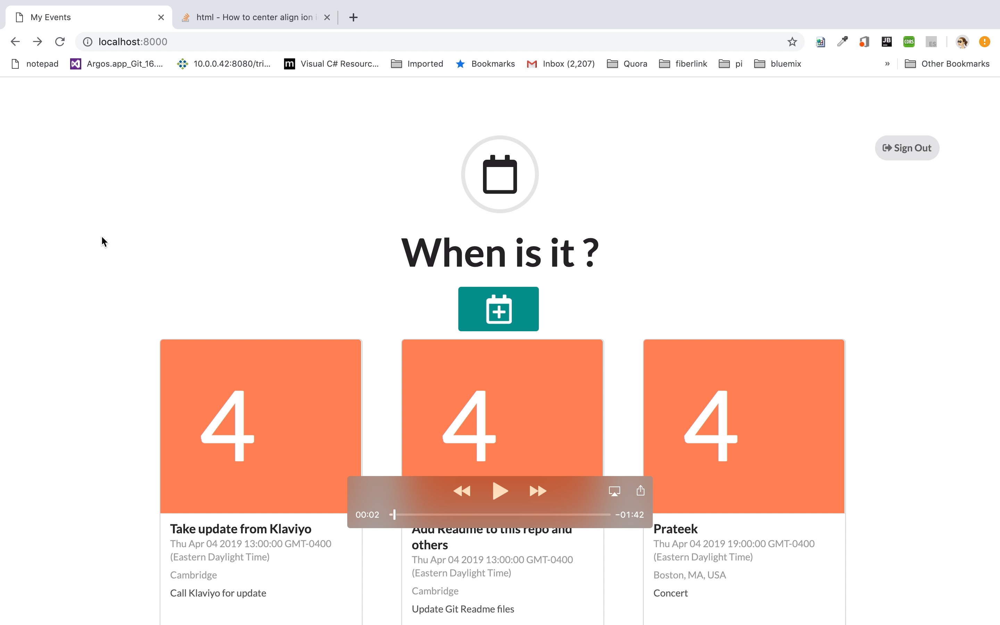

# Meeting Viewer and Event Generator

I am "actively involved in the interview process". While doing so I found it difficult to view the planned week's, month's events, meetings and calls on the same page of Google Calendar . I had to swipe through dates and months to get an overview of all the events I have lined up. I then created a very simple and easy-to-use "Event Viewer and Creator" using HTML5 , JavaScript , SCSS , Semantic UI Framework and Google Calendar API.

#Key Feature

  * Uses Google Calendar API to retrieve events from a specific date range
  * View events and its details in clean UI
  *  Create new event for oneself quickly with minimal details.
  * View the new event it on any device / google map

# Demonstration

The following demonstration provides an overview of the application : Click the image below Alt text

# Run this application

  * Clone the repository

  * git clone https://github.com/debanjana/event-scheduler.git  

  * Create your API key and Web Client by following the steps mentioned in https://developers.google.com/calendar/

  * Replace the existing Key and Web Client in index.js file with your Credentails

  * Start the python to run the code

  * python -m SimpleHTTPServer 8000
